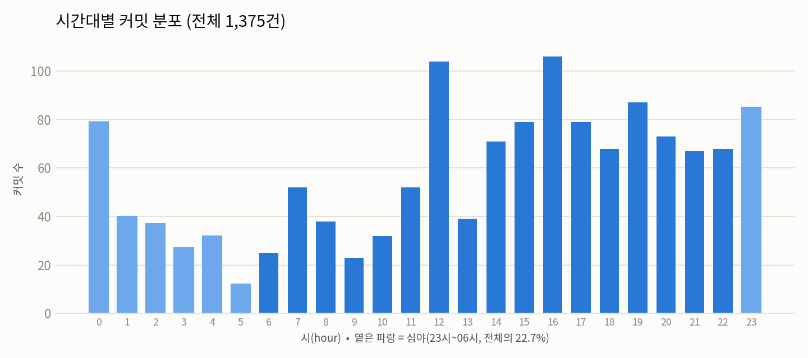
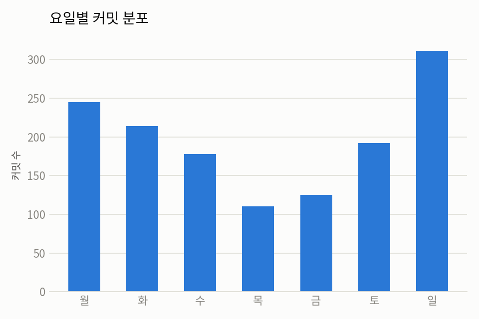
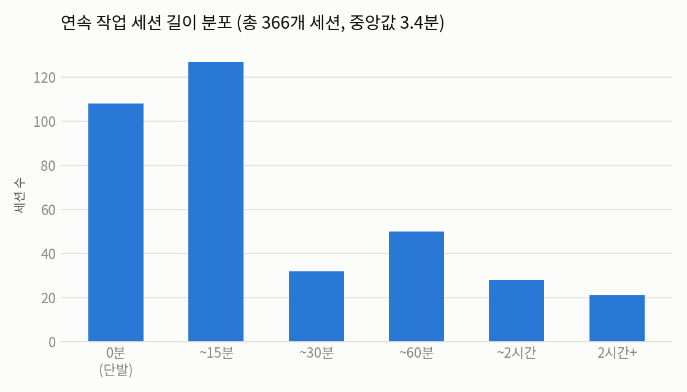
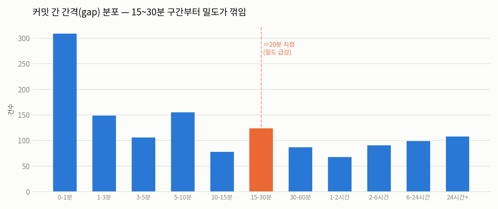

# ADHD-irection 기획 결정 로그

> ADHD(추정) 성향으로 인한 집중력·단기 작업 기억 저하를 돕기 위한 개인 작업 패턴 분석 앱.
> 이 문서는 최초 기획부터 어떤 근거로 방향이 바뀌었는지 그 흐름을 그대로 남긴다. 최신 상태만 보려면 8번으로 바로 이동.

---

## 1. 초기 기획 (v1)

**기술 스택**
- **프레임워크**: Expo (React Native) — 기존 Next.js / TypeScript / React Query / Zustand / FSD 아키텍처를 그대로 재사용 가능
- **백엔드**: Next.js API Route + Supabase

**패턴 분석 아이디어**
- OS 레벨 사용량 API 대신 **앱 자체 행동 로그**(포모도로 세션, `AppState` 백그라운드 전환, 작업 유형 전환 빈도)를 1차 신호로 사용
- Android는 `UsageStatsManager`를 선택적 기능으로, iOS는 `DeviceActivity` 계열 API가 3rd-party 앱으로 사용 데이터를 넘겨주지 않는 구조적 제약이 있어 처음부터 기대하지 않기로 함

**외부 데이터 연동**
- GitHub API + Webhook — 커밋 타임스탬프를 코딩 리듬 신호로 사용
- Notion API + Webhook — 페이지 편집 이력 동기화

**학습 노트(태블릿) 연동**
- 태블릿 작업(갤럭시 기본 Notes 앱)은 서드파티 API가 없어 자동 연동이 불가능함을 확인
- → **오늘 공부한 내용을 PDF로 export해서 앱에 직접 업로드**하는 방식으로 확정 (`expo-document-picker`, 텍스트는 `pdf-parse`, 손글씨는 비전 모델 fallback)

---

## 2. 방향 재검토 — "모바일 중심 구조가 맞나?"

여기까지 설계한 핵심 기능은 **"인터럽트가 발생한 순간을 낮은 마찰로 캡처"** 하는 것이었다. 그런데 다시 보니 구조적 문제가 있었다:

- 실제 작업 전환(코딩 ↔ Notion ↔ 브라우저)은 **MacBook에서** 일어난다
- 그런데 감지 로직으로 설계했던 `AppState` 앱 전환 감지는 **모바일 앱 안에서만** 작동한다 — 폰으로 다른 앱을 켜고 끄는 걸 감지하는 것이지, 맥에서 VSCode를 나가고 Notion을 켜는 걸 감지하는 게 아니다
- 즉 "인터럽트 순간을 낚아채는" 핵심 기능이 모바일 앱만으로는 애초에 성립하지 않는 지점이었다

### 검토했던 선택지

| 안 | 내용 |
|---|---|
| A. 데스크톱 캡처 + 모바일 보조 | 맥에서 캡처 도구를 만들고, 모바일은 이동 중 캡처·리뷰·PDF 업로드만 담당 |
| B. 모바일 유지, 자동감지 포기 | 자동 트리거 없이 정시/랜덤 알림으로 다운그레이드 |
| C. 트리거 보류 | 캡처 설계는 미루고 리뷰·업로드 기능부터 구현 |

**→ A안 채택.** 실제 작업이 일어나는 위치에 캡처 도구를 두는 게 근본적으로 맞다고 판단.

---

## 3. 재구성 (v2) — 데스크톱 캡처 + 모바일 보조

**데스크톱 캡처 앱: Tauri 메뉴바 앱**
- UI는 React/TypeScript 그대로 작성 (기존 스택 재사용), Rust는 트레이 아이콘·전역 단축키·백그라운드 상주 정도만 담당
- Electron보다 가볍고 배포 부담이 적음

**재정리된 구조**

| 구성 요소 | 역할 |
|---|---|
| 데스크톱 캡처 앱 (Tauri) | 실제 작업 전환 순간의 저마찰 캡처 (신규) |
| 모바일 앱 (Expo) | 이동 중 캡처, 학습노트 PDF 업로드, 패턴 대시보드 리뷰 |
| 백엔드 (Next.js API + Supabase) | 공통 캡처 API, GitHub/Notion 웹훅 수신, 패턴 분석 |

두 클라이언트가 캡처 API 하나를 공유하는 구조.

---

## 4. ADHD 특성 분석 — 왜 "인터럽트 캡처"가 핵심 기능인가

기획 방향을 잡기 위해 ADHD 관련 어려움을 정리했다:

1. **작업 개시 마찰 (Task Initiation)** — 시작하는 순간의 심리적 저항이 큼
2. **작업 기억 붕괴 (Working Memory)** — 인터럽트가 끼면 이전 맥락이 통째로 날아감
3. **시간맹 (Time Blindness)** — 시간 경과에 대한 내적 감각이 약함
4. **인터럽트 이후 복귀 비용** — 전환 자체보다 "원래 맥락으로 돌아오는 것"이 훨씬 비쌈
5. **눈에 안 보이면 존재하지 않는 것 (Object Permanence)** — 기록해둬도 시야 밖으로 나가면 인지에서 사라짐

→ 2번(작업 기억)과 4번(복귀 비용)이 "집중력·단기 작업 기억" 문제와 정확히 겹침. 그래서 **"이탈 후 복귀 시점에 방금 하던 일의 맥락을 남기는 기능"**을 앱의 핵심으로 잡기로 함 — 사후 분석용 대시보드가 아니라, 매일 실제로 도움이 되는 기능.

---

## 5. 캡처 마찰 문제와 해결

기존에 쓰던 할일 앱의 문제: 직접 타이핑해야 해서 일이 몰릴 때일수록 기록을 포기하게 됨.

**해결 — 타이핑 없는 캡처**
- **1순위: 음성 메모** — 원탭 녹음 5~15초 → 비동기 STT(Whisper/Claude API)로 나중에 텍스트화
- **2순위: 원탭 프리셋 태그** — "막힘" / "거의 다 함" / "전환함" / "휴식" 등 버튼 하나로 끝
- **보조: 자동 컨텍스트 추론** — 캡처 시점의 활성 앱 정보를 자동 기록해서 사용자 입력이 없어도 최소한의 흔적은 남김

---

## 6. 실측 데이터 분석 — 실제 작업 패턴

"트리거를 언제 발생시킬지"를 감으로 정하지 않기 위해, MacBook에 로컬로 있는 실제 저장소 6개(`bon-ron`, `connecting-road-web`, `connectors-cluster-config`, `connectorsfrontend`, `portfolio`, `todo-api`)의 **커밋 이력 1,375건**을 직접 분석했다.

### 6-1. 시간대별 분포



특정 시간대에 몰리지 않고 하루 전체에 넓게 분산. 12시·16시·19시·23시에 국지적 피크, 05~06시·09~10시가 저점. **심야(23시~06시) 작업이 전체의 22.7%(312/1375건)** — 트리거를 "업무시간대만" 작동하게 만들면 안 된다는 근거.

### 6-2. 요일별 분포



일요일(311건)·월요일(245건)이 가장 많고 목요일(110건)이 가장 적음. 본업(비개발직) 평일보다 주말에 개인 프로젝트 작업이 몰리는 구조.

### 6-3. 세션 파편화 — 가장 중요한 발견

커밋 간 간격 60분을 기준으로 "연속 작업 세션"을 묶었을 때:

| 지표 | 값 |
|---|---|
| 총 세션 수 | 366개 |
| 세션당 평균 커밋 수 | 3.8개 |
| 세션 평균 길이 | 25.6분 |
| **세션 길이 중앙값** | **3.4분** |
| 2시간 넘는 세션 | 21개 (5.7%) |



평균(25.6분)과 중앙값(3.4분)의 큰 차이는 극소수의 긴 몰입 세션이 평균을 끌어올릴 뿐, **실제로는 짧은 작업 버스트가 대다수**임을 의미. "짧은 작업 기억, 지속적 집중의 어려움" 가설과 일치하는 실증 데이터.

### 6-4. 전환 패턴

- 한 세션(60분 이내) 안에서 저장소를 넘나든 비율: **22/366 = 6.0%**
- 하루 단위로 2개 이상 저장소를 건드린 날: **56/180일 = 31.1%**

→ 전환은 "그 순간 즉시"가 아니라 **시간 간격을 두고(휴식/다른 일 하고 돌아와서)** 일어난다는 뜻. 지난번 설계했던 "앱/저장소 전환 즉시 감지" 트리거보다, **"이탈 후 복귀 시점"**을 잡는 게 실제 패턴에 더 맞다는 근거.

### 6-5. Gap 분포로 찾은 임계값

커밋과 커밋 사이 간격(gap) 1,374개 전체의 분포:



| 구간 | 비율 |
|---|---|
| 0~15분 | 52.3% |
| 15~30분 | 9.0% |
| 30~60분 | 6.3% |
| 1~2시간 | 4.9% |
| 2시간+ | 27.5% |

15~20분을 넘어가는 지점부터 밀도가 뚜렷하게 꺾인다. 즉 **15~20분 이내 간격은 자연스러운 소강(생각 정리, 문서 확인)**이고, 그걸 넘기면 실제 이탈일 가능성이 높다는 뜻. → 이 지점을 idle 판정 임계값(20분)으로 채택.

### 6-6. 최근 30일 (참고)

최근 30일 커밋은 26건뿐이고 오후 3~9시에만 몰려 있어 심야 작업이 없음 — 최근엔 좀 더 규칙적으로 바뀐 걸로 보이나 표본이 작아 확정하기는 이름.

---

## 7. 트리거 로직 최종안 (v2, 데이터 기반)

### 자동 트리거 — Idle → Resume (핵심)
- 시스템 유휴시간이 **20분 이상** 지속되면 "이탈 상태"로 판정 (근거: 6-5 gap 분포의 자연스러운 경계)
- 이탈 상태에서 키보드/마우스 입력이 재개되는 **복귀 순간**에 캡처 모달 자동 팝업
- 리밋: 직전 캡처로부터 20분 이내엔 재발생 안 함 (짧은 반복 이탈로 인한 알림 남발 방지)
- 시간대 제한 없음 (6-1 근거: 심야 작업 22.7%)

**폐기된 대안**: "앱/저장소 전환 즉시 감지". 실측상 한 시간 이내 저장소 전환은 6%뿐이고 전환 대부분이 텀을 두고 일어나므로(6-4), "전환의 순간"보다 "이탈 후 복귀의 순간"을 잡는 게 맞음.

### 수동 트리거 — 항상 보조로 유지
- 전역 단축키로 언제든 즉시 캡처
- 자동 감지가 못 잡는 케이스(20분 미만의 빠른 전환, 이탈 없이 바로 넘어가는 6% 케이스)를 사용자가 직접 커버

### 2단계 보류 — 활성 상태 전환 감지
- 이탈 없이 활성 창만 빠르게 바뀌는 경우까지 잡으려면 `NSWorkspace`/Accessibility 권한 기반 추적이 필요한데, 데이터상 이 케이스는 소수(6%)라 MVP에서는 제외. 실사용 데이터가 쌓이면 재검토.

### 기술 구현 메모 (Tauri)
- 유휴시간 측정: Rust `user-idle` 크레이트 (macOS는 IOKit `HIDIdleTime` 기반), 60초 주기 폴링
- 유휴 20분 도달 → 내부 상태 `idle` 전환 → idle time 리셋(활동 재개) 시점에 캡처 창 팝업
- 리밋 로직: 마지막 캡처 타임스탬프를 로컬에 저장해두고 비교

---

## 8. 현재 확정된 아키텍처 요약

| 영역 | 결정 사항 |
|---|---|
| 데스크톱 캡처 | Tauri 메뉴바 앱, idle(20분)→resume 자동 트리거 + 전역 단축키 수동 트리거 |
| 캡처 입력 방식 | 음성 메모(비동기 STT) 1순위, 원탭 프리셋 태그 2순위 |
| 모바일 앱 | Expo(React Native) — 이동 중 캡처, 학습노트 PDF 업로드, 패턴 대시보드 리뷰 |
| 백엔드 | Next.js API Route + Supabase, 캡처 API를 두 클라이언트가 공유 |
| 외부 연동 | GitHub API+Webhook(커밋 리듬), Notion API+Webhook(편집 이력) |
| 학습노트 | Samsung Notes 자동 연동 불가 → PDF export 후 앱 업로드로 대체 |
| 보류 | 활성 창 전환 자동 감지(Accessibility API 기반) — 데이터 근거 부족으로 2단계로 연기 |

---

## 9. 백엔드/DB 재검토 — NestJS + PostgreSQL(직접 설계)

당초 Next.js API Route + Supabase로 잡았던 백엔드를 재검토:

- 백엔드를 **NestJS**로 별도 구축하기로 함 (Next.js API Route에서 분리)
- DB는 Supabase(매니지드 BaaS) 대신 **PostgreSQL을 직접 설계**하기로 함 — SQL 기반 스택을 최종 목표로 삼고 있어, 복잡한 관계형 스키마를 스스로 설계·운영해보는 것 자체가 목적
- ORM은 **TypeORM** 채택 (NestJS 공식 문서가 기본으로 다루는 조합), 단 마이그레이션은 자동생성 대신 **raw SQL로 직접 작성** — "SQL을 직접 짜본다"는 학습 목표에 가장 직접적으로 닿는 부분
- 로컬 개발은 Docker Compose Postgres, 배포는 Neon/Railway 등 순수 매니지드 Postgres

실제 스키마 초안:

```
repos            (id, name, local_path, github_full_name)
captures         (id, user_id, repo_id FK nullable, type[voice|tag], content, source[desktop|mobile], captured_at)
sessions         (id, started_at, ended_at, trigger_type[idle_resume|manual])
session_captures (session_id FK, capture_id FK)   -- N:M
github_events    (id, repo_id FK, event_type, committed_at)
notion_events    (id, page_id, edited_at)
study_notes      (id, uploaded_at, source_pdf_path, extracted_summary, repo_id FK nullable)
```

## 10. 모노레포 채택

모바일(Expo)/데스크톱(Tauri)/백엔드(NestJS) 세 앱을 하나의 레포로 관리하기로 결정. 근거:

1. **API 계약 공유**: 세 앱이 같은 캡처 API(Capture, Session)를 주고받음. 이미 핵심 스택인 Zod로 스키마를 `packages/shared-types`에 한 번만 정의하면, 백엔드는 `nestjs-zod` 등으로 DTO 검증에, 두 클라이언트는 React Hook Form + Zod 폼 검증에 그대로 재사용 가능. 레포가 나뉘면 이 스키마를 패키지로 배포·버전 관리해야 하는 오버헤드가 생김
2. **원자적 스키마 변경**: DB 마이그레이션 하나가 API DTO + 모바일/데스크톱 클라이언트 코드를 동시에 바꿔야 하는 구조라, 한 커밋/PR로 세 곳을 함께 바꿀 수 있어야 배포 순서 문제(백엔드는 배포됐는데 클라이언트가 옛 스키마를 기대하는 등)를 피할 수 있음
3. **1인 개발**: 멀티레포의 버전 태깅·cross-repo 이슈 트래킹 비용을 상쇄할 팀 단위 이점이 없는 개인 프로젝트

**주의점**: 세 앱의 빌드 파이프라인이 서로 다름(Expo EAS / Tauri Cargo / NestJS Docker) → pnpm workspaces + Turborepo로 태스크를 스코프별로 분리해서 관리.

```
adhd-irection/
├── apps/
│   ├── mobile/       (Expo)
│   ├── desktop/      (Tauri)
│   └── api/          (NestJS)
├── packages/
│   └── shared-types/ (Capture/Session Zod 스키마 + API 타입)
├── docs/
├── pnpm-workspace.yaml
└── turbo.json
```

---

## 11. Turborepo 도입 보류

pnpm workspaces는 채택하되, Turborepo는 지금 넣지 않기로 함.

**이유**: Turborepo가 값어치를 하는 상황은 ①빌드 시간이 CI에서 실제로 아파질 때 ②`shared-types` 변경 순서 문제가 실제로 버그를 낸 적이 있을 때 ③여러 명이 캐시를 공유해야 할 때인데, 지금은 1인 개발·앱 3개·CI 없음 단계라 셋 다 해당 안 됨. `packages/shared-types`가 순수 TypeScript라 tsconfig `paths`로 소스를 직접 참조하면 "먼저 빌드해야 하는 순서" 문제 자체가 애초에 안 생김. 세 앱 동시 실행은 `concurrently` + pnpm 스크립트로 충분.

**나중에 추가할 때 비용이 거의 0인 이유**: 지금 구조(`apps/*`, `packages/*`)가 이미 Turborepo가 기대하는 표준 구조라, 필요해지면 `turbo.json` 추가 + 스크립트를 `turbo run dev`로 바꾸기만 하면 됨. 폴더 재구성이 필요 없어서 "일단 넣어두고 익숙해지자"가 아니라 "필요해질 때 넣어도 손해 없다"는 계산이 성립.

**재도입 트리거**: `pnpm run dev` 스크립트가 손으로 관리하기 번거로워질 때 / shared-types 변경 후 특정 앱이 옛 버전을 참조해 버그가 난 적이 있을 때 / CI를 붙였는데 매번 전체 재빌드로 시간이 아깝게 느껴질 때.

## 12. 모바일 앱 재검토 — Expo 대신 Next.js PWA

Apple Developer Program(연 $99)이 미니 프로젝트 치고 비싸다는 문제 제기에서 시작된 재검토.

**검토 배경**: 모바일 앱에 실제로 필요한 기능은 ①음성 녹음(캡처) ②PDF 업로드(학습노트) ③패턴 대시보드 리뷰 세 가지뿐. 자동 이탈 감지 같은 OS 레벨 트리거는 이미 3절에서 데스크톱으로 옮겨놨기 때문에, 모바일에 네이티브 모듈이 필요한 이유가 애초에 없었음.

**확인한 사실**: 이 세 기능은 전부 iOS Safari/PWA로 커버됨 —
- 음성 녹음: `MediaRecorder` API, iOS 14.3+
- PDF 업로드: `<input type="file">`로 파일 앱 접근
- 푸시 알림(필요해질 경우): iOS 16.4+부터 홈 화면에 추가된 PWA에 한해 Web Push 지원, **Apple Developer Program 없이도 동작**

**결정**: `apps/mobile`을 Expo(React Native) 대신 **Next.js PWA**로 변경. 부수 효과로 Expo보다 오히려 러닝커브가 낮아짐 — Next.js는 이미 근재님 코어 스택이라 새로 배울 게 없음. Apple Developer Program은 모바일 쪽에선 완전히 불필요해짐.

## 13. 배포 플랫폼 선택

**프론트(Next.js PWA) → Vercel**: Vercel은 Next.js에 최적화된 PaaS. 무료 티어(대역폭 100GB/월)로 개인 사용 트래픽은 충분히 커버.

**백엔드(NestJS) → Railway (Render 대신)**: 처음엔 Render 무료 티어를 고려했으나, 15분 무활동 시 슬립되어 재기동 지연(수십 초)이 생기는 게 단점. Railway Hobby 플랜($5/월 고정 구독, $5어치 사용량 포함)으로 전환 — 슬립 없는 상시 실행의 대가로 월 $5는 감수 가능한 수준으로 판단. DB는 Railway가 아니라 Neon에 그대로 둬서 Railway 쪽 사용량을 API 서비스 하나로 최소화.

**DB → Neon PostgreSQL**: 무료 티어로 개인 캡처 데이터 규모 충분히 커버.

**주의**: Vercel은 애초에 NestJS 같은 상시 실행 서버에 안 맞는 플랫폼(서버리스 함수는 요청 시에만 켜졌다 꺼지는 구조라 DB 커넥션 풀 유지 등에 불리함) — 그래서 "Vercel이냐 AWS냐"가 아니라 처음부터 "프론트=Vercel, 백엔드=별도 상시 컨테이너"로 역할이 나뉘어 있었음.

## 14. GitHub Actions 비용 재확인 — public 레포의 이점

Tauri 데스크톱 릴리스 빌드는 macOS 러너가 필수(macOS 앱 서명/공증은 실제 macOS에서만 가능). macOS 러너는 분당 과금 배수가 Linux 대비 **10배**인데, 이 배수는 **private 레포에만 적용**된다는 걸 확인함. `tjrmswo/ADHD-irection`은 **public 레포**라서 GitHub 호스팅 러너는 OS 상관없이 무제한 무료 — macOS 러너 비용 걱정 자체가 이 프로젝트엔 해당 없음. (레포를 public으로 유지해야 하는 이유가 하나 더 생긴 셈.)

## 15. 비용 상한선 정책

미니 프로젝트 정체성을 지키기 위한 예산 가이드라인:

| 단계 | 월 예산 상한선 |
|---|---|
| 현재 (Vercel+Railway+Neon+GitHub Actions) | **$5** (Railway 고정비만) |
| 커스텀 도메인 추가 시 | +1~2천원/월 |
| AWS 확장 시 (Fargate+RDS, NAT Gateway 회피) | 약 1~1.5만원/월 |
| NAT Gateway를 실무처럼 그대로 쓸 때 | +4만원/월 — **이 지점부터 미니 프로젝트 범위를 넘어선 것으로 판단** |

AWS(ECS Fargate + RDS + Terraform/CDK)는 학습 목적의 확장 방향으로 남겨두되, 지금 당장 옮길 이유는 없음. NAT Gateway를 켜는 순간이 실질적인 비용 경계선.

## 16. 모노레포 스캐폴딩 시 정한 세부 사항 (2026-10-02)

- **shared-types 참조 방식**: 11절에서는 "tsconfig `paths`로 소스 직접 참조"라고 적었지만, 실제로는 `package.json`의 `exports`가 `./src/index.ts`를 가리키게 하고 각 앱이 `workspace:*`로 의존하는 방식으로 구현. 빌드 단계가 없다는 점은 동일하고, 앱마다 `paths`를 따로 맞출 필요가 없음. NestJS(ESM)는 런타임에 Node 24의 타입 스트리핑으로 `.ts`를 그대로 읽으므로 **shared-types는 지워지는 문법(enum·namespace 금지)만 쓰고 상대 import에 `.ts` 확장자를 붙여야 함** (`erasableSyntaxOnly`로 강제). Next.js는 `transpilePackages`, Vite는 별도 설정 없이 동작
- **Node 24 이상 필수**: 위 타입 스트리핑 때문. Railway 배포 이미지도 Node 24로 맞춰야 함
- **포트**: API 기본 포트를 4000으로 변경 (Next.js dev 서버 3000과 충돌 방지). Tauri dev는 1420
- **ID 타입**: Zod 스키마에서 id를 UUID로 가정. 9절 초안에는 타입이 없었으므로 마이그레이션 작성 시 바꾸려면 `shared-types`도 함께 수정
- **프리셋 태그 코드값**: `blocked`(막힘) / `almost_done`(거의 다 함) / `switched`(전환함) / `break`(휴식)

## 17. `apps/mobile` → `apps/web` 이름 변경 (2026-10-02)

Next.js PWA는 폰 전용이 아니라 캡처를 제외한 모든 화면(패턴 대시보드, 캡처 기록 조회, 학습노트 PDF 업로드, 이동 중 캡처)을 담당하고, 맥 브라우저에서도 주로 쓰게 됨. `mobile`이라는 이름이 실제 역할보다 좁아서 `apps/web`(패키지명 `@adhd-irection/web`)으로 변경. 역할 분담 자체는 그대로 — `apps/desktop`(Tauri)은 OS 권한이 필요한 캡처 순간만 담당. 캡처의 `source` 값은 18절에서 `desktop` | `web`으로 변경.

## 18. 초기 스키마 마이그레이션 작성 시 정한 세부 사항 (2026-10-02)

9절 초안 7개 테이블 + `users`를 `apps/api/src/database/migrations/1790920800000-InitSchema.ts`에 raw SQL로 작성. 초안에 없던 부분은 다음과 같이 정함:

- **PK**: 전부 `uuid` + `DEFAULT gen_random_uuid()` (Postgres 13+ 내장, 확장 불필요)
- **열거형 값**: Postgres `ENUM` 타입 대신 `text` + `CHECK` 제약. 값 추가/삭제가 제약 하나 교체로 끝나고, ENUM은 값 삭제가 불가능해서 초기 단계엔 CHECK가 다루기 쉬움
- **시각 컬럼**: 전부 `timestamptz`
- **`users` 테이블 추가**: 초안에는 없었지만 `captures.user_id`가 가리킬 대상이 필요해서 최소 컬럼(`id`, `name`, `created_at`)으로 추가하고 FK(`ON DELETE CASCADE`)를 걺. 인증은 **카카오 로그인을 NestJS로 직접 구현**할 계획이고, 그때 `kakao_id` 등은 새 마이그레이션으로 추가. 그 전까지는 `SeedTempUser` 마이그레이션이 넣는 임시 유저(`00000000-0000-4000-8000-000000000001`) 하나로 테스트
- **`captures.source` 값**: 9절 초안의 `desktop | mobile`을 `desktop | web`으로 변경 (17절에서 앱 이름을 `apps/web`으로 바꾼 것과 맞춤. 맥 브라우저에서 한 캡처가 `mobile`로 찍히는 어색함 제거)
- **삭제 동작**: repo 삭제 시 `captures`/`study_notes`의 `repo_id`는 `SET NULL`(기록은 남김), `github_events`는 `CASCADE`. `session_captures`는 양쪽 다 `CASCADE`
- **`sessions`**: `ended_at`은 nullable(진행 중), `ended_at >= started_at` CHECK 추가
- **인덱스**: 시간순 조회용(`captured_at`, `started_at`, `committed_at`, `edited_at`, `uploaded_at`)과 FK 역방향 조회용만 추가
- **로컬 Postgres 버전**: `postgres:17-alpine`

**검증**: 작성 시점에 맥에 Docker가 없어서 Docker Compose로는 못 돌려봄. 대신 임시 Postgres(embedded-postgres 18.4)에 `migration:run` → 제약/CASCADE 동작 확인 → `migration:revert` → 재실행까지 통과. 이후 Docker 설치 뒤 `pnpm db:up` → `pnpm db:migrate`도 로컬에서 통과 확인.

**Nest ↔ DB 연결**: `@nestjs/typeorm`의 `TypeOrmModule.forRoot()`에 CLI와 같은 `data-source.ts` 설정을 그대로 넘김(설정 한 곳). `.env` 로딩은 `@nestjs/config` 없이 Node 내장 `process.loadEnvFile`로 처리 — 환경변수가 `DATABASE_URL` 하나뿐이라 패키지를 더 얹지 않음. 마이그레이션은 앱 기동 시 자동 실행하지 않고 `pnpm db:migrate`로만 실행.

## 19. 데스크톱 캡처 MVP — 수동 단축키부터 (2026-10-02)

- **트리거 순서**: idle→resume보다 전역 단축키를 먼저 구현. 누르면 바로 결과가 보여 검증이 쉽고, 캡처 모달·API 전송은 두 트리거가 공유하므로 idle 감지는 나중에 트리거만 덧붙이면 됨
- **단축키**: `Option+Shift+C` (`tauri-plugin-global-shortcut`). 다른 앱과 충돌하면 `src-tauri/src/lib.rs`에서 변경
- **캡처 창**: 앱 시작 시 숨겨진 상태로 떠 있다가 단축키로 표시. 저장 후 또는 Esc로 다시 숨김. 창을 닫아도 종료하지 않고 숨김 처리(단축키 유지 목적). 메뉴바(트레이) 아이콘은 아직 없음
- **입력**: MVP는 프리셋 태그 4종만(숫자키 1~4 또는 클릭). 음성 메모는 STT 연동이 필요해 다음 단계
- **API 호출**: 웹뷰에서 `fetch`로 직접 호출. 이를 위해 API에 CORS 허용 origin 추가(`http://localhost:1420`, `tauri://localhost`, `http://localhost:3000`). API 주소는 `VITE_API_URL`(기본 `http://localhost:4000`)

## 20. idle→resume 자동 트리거 구현 시 정한 세부 사항 (2026-10-02)

7절의 최종안(유휴 20분 → 복귀 시 캡처 창)을 `apps/desktop/src-tauri/src/idle.rs`에 구현. 7절 구현 메모와 달라진 점:

- **폴링 주기**: 7절은 60초 고정이었으나, 평소 60초 / **이탈 중에는 1초**로 변경. 60초 고정이면 복귀 후 창이 뜨기까지 최대 1분이 걸려 "복귀한 순간"을 놓침. 유휴시간 조회는 비용이 거의 없음
- **잠자기 대응 추가**: 맥북을 덮으면 폴링 스레드도 멈춰서 유휴시간만으로는 이탈을 못 봄. 관측 간격(벽시계 기준)이 임계값 이상 벌어졌으면 이탈했던 것으로 판정. 7절에는 없던 케이스
- **포커스**: 자동 트리거는 창을 띄우되 **포커스를 뺏지 않음**. 복귀 판정 자체가 입력으로 이뤄지므로, 포커스를 가져오면 다른 앱에 치던 숫자가 태그 선택(1~4)으로 들어갈 수 있음. 대신 `acceptFirstMouse`로 첫 클릭이 바로 버튼에 먹게 함. 수동 단축키는 기존대로 포커스를 줌
- **재발생 제한**: "마지막 캡처 타임스탬프를 로컬에 저장" 대신, 캡처 창이 마지막으로 뜬 시각을 **메모리에만** 보관. 제한 시간이 유휴 임계값과 같은 20분이라, 이탈 판정 자체가 직전 창 표시 후 20분 경과를 이미 보장함 — 두 값을 다르게 둘 때만 의미가 생기는 안전장치라 디스크 저장까지는 하지 않음
- **개발용 임계값**: `ADHD_IDLE_THRESHOLD_SECS` 환경변수로 줄여서 확인 (재발생 제한도 같은 값을 따름)
- **판정 로직 분리**: 이탈/복귀 판정은 순수 로직(`ResumeDetector`)으로 떼어 Rust 단위 테스트로 검증

## 21. 캡처 조회 구현 시 정한 세부 사항 (2026-10-03)

- **`GET /captures`**: 최신순(`captured_at DESC`)으로 돌려줌. 쿼리는 `limit`(기본 50, 최대 200)과 `before`(이 시각보다 이전만, 다음 페이지용 커서). offset 대신 커서를 쓴 이유는 조회 도중 새 캡처가 들어와도 페이지가 밀리지 않고, 기존 `(user_id, captured_at DESC)` 인덱스를 그대로 타기 때문. 같은 밀리초의 캡처가 페이지 경계에 걸리면 빠질 수 있으나 1인 수동 입력 규모에서는 무시
- **웹은 서버 컴포넌트에서 조회**: 브라우저가 아니라 Next 서버가 API를 호출. 폰에서 열 때 API 주소를 폰 기준으로 맞출 필요가 없고 CORS도 타지 않음. API 주소는 서버 환경변수 `API_URL`(기본 `http://localhost:4000`)
- **표시 시간대**: 서버에서 렌더링하므로 서버 시간대(Vercel은 UTC)에 맡기지 않고 `Asia/Seoul`로 고정. 저장값은 `timestamptz` 그대로이고, 로컬 Postgres의 표시 시간대만 `docker-compose.yml`에서 `Asia/Seoul`로 맞춤. 해외에서 쓸 일이 생기면 클라이언트 포맷으로 변경
- **첫 화면**: 대시보드가 생기기 전까지 `/`는 `/captures`로 리다이렉트
- **스크린샷은 보류**: 캡처는 화면 이미지가 아니라 태그·시각·출처 텍스트 기록. 복귀 시 맥락은 우선 활성 앱 이름·창 제목(텍스트)으로 남기고, 그걸로 부족하면 스크린샷을 검토. 본인 전용 앱이라 화면 기록 권한 자체는 문제가 아니지만, 이미지 저장소(현재 배포 구성에 없음)와 화면에 찍히는 민감 정보가 걸림
- **미해결**: 자동 트리거(idle→resume)로 뜬 창의 캡처와 단축키 캡처가 둘 다 `source=desktop`으로 저장돼 구분되지 않음. 활성 앱 정보 컬럼을 추가하는 마이그레이션 때 트리거 종류 컬럼도 함께 검토

## 22. 메뉴바 아이콘과 캡처 맥락 기록 구현 시 정한 세부 사항 (2026-10-03)

- **메뉴바 상주**: macOS에서 activation policy를 `Accessory`로 바꿔 Dock과 Cmd+Tab에서 빠지고, 메뉴바 아이콘(트레이)만 남김. 메뉴는 "캡처"와 "종료" 두 개. 지금까지는 종료하려면 터미널에서 `kill`해야 했음. 아이콘은 다크/라이트 메뉴바에 자동으로 맞춰지는 템플릿 이미지(`icons/tray.png`)
- **캡처 맥락 컬럼 추가**: `captures`에 `trigger_type`(`idle_resume`/`manual`), `active_app`, `window_title`을 추가 (`AddCaptureContext` 마이그레이션). 21절에서 미해결로 남긴 "자동 트리거와 단축키 캡처가 구분되지 않는 문제"를 여기서 해결. 값은 `sessions.trigger_type`과 같은 집합을 재사용. 기존 행과 웹 캡처는 알 수 없으므로 전부 nullable이고, API는 필드를 보내지 않으면 null로 저장
- **활성 앱 읽는 시점**: 캡처 창을 띄우기 **직전**에 Rust에서 읽어 메모리에 두고, 저장할 때 웹뷰가 `capture_context` 커맨드로 가져감. 창을 띄운 뒤에 읽으면(특히 포커스를 가져오는 수동 트리거) 이 앱 자신이 잡힘. 이미 떠 있는 창을 다시 부른 경우에는 처음 뜬 순간의 맥락을 유지
- **창 제목은 권한이 있을 때만**: `active-win-pos-rs` 크레이트 사용. 앱 이름은 권한 없이 읽히지만 창 제목은 macOS **화면 기록 권한**이 있어야 채워짐. 권한이 없으면 `window_title`은 null로 저장하고 나머지는 정상 동작 — 권한을 요구하는 팝업은 띄우지 않음. 개발 빌드(`tauri dev`)에서는 창 제목까지 기록되는 것을 확인(예: `Code — captures — ADHD-irection`). 권한은 서명에 묶여 있어 배포용 앱에서는 따로 허용해야 할 수 있음 — 미확인
- **한 번에 켜고 끄기**: `pnpm start`는 DB를 올린 뒤 API·웹·데스크톱을 함께 띄우고, 셋 중 하나가 끝나면(`concurrently -k`) 나머지도 끄고 DB까지 내림. 그래서 메뉴바의 "종료"나 Ctrl+C 한 번으로 전부 꺼짐. `pnpm stop`(`scripts/stop.sh`)은 터미널 여러 개에 따로 띄운 것까지 프로세스 이름과 포트(4000/3000/1420)로 찾아 끄고 DB를 내림. DB 데이터는 볼륨에 남음. 기존 `pnpm dev`는 그대로 둠(DB를 건드리지 않고 셋만 실행)
- **개발 로그**: 캡처 창이 뜰 때 터미널에 `[capture] 계기 / 앱 / 창 제목` 출력

## 23. 핵심 기획 구체화 — 작업 흔적을 보여주고 작게 보상하기 (2026-10-03)

캡처만으로는 "얼마나 작업하고 있는지"가 보이지 않음. GitHub 커밋과 Notion 편집을 캡처와 합쳐 보여주고, ADHD가 흥미를 느낄 만한 작은 보상으로 돌려주는 것을 핵심 기획으로 삼음.

**작업량의 단위 = 작업 블록**: 하루를 30분 칸 48개로 나누고, 그 칸에 커밋·Notion 편집·캡처 중 하나라도 있으면 채워진 것으로 봄. 작업 시간은 정확히 잴 수 없고 커밋 수는 커밋 크기에 따라 왜곡되므로 "그 시간에 손을 대고 있었다"만 봄. 코딩과 정리(Notion)가 같은 단위로 합쳐짐.

**보상 원칙**: 작게, 즉시, 벌점 없이. 연속 기록(스트릭)은 넣지 않음 — 하루 끊기면 0으로 돌아가는 구조는 한 번 놓쳤을 때 손을 놓게 만듦. 끊기지 않은 것이 아니라 **돌아온 것**을 셈.

| 요소 | 내용 | 단계 |
|---|---|---|
| 오늘의 띠 | 30분 칸 48개가 출처별 색으로 채워짐 | 1 |
| 돌아온 횟수 | 자리를 비웠다 돌아와 남긴 캡처 수 (`trigger_type = idle_resume`) | 1 |
| 최근 4주 | "최근 7일 중 N일 작업" + 날짜별 농도 | 1 |
| 복귀 요약 | 캡처 창에 떠나기 전 흔적 한 줄 (예: 떠나기 전 40분 동안 커밋 3개) | 2 |
| Notion 편집 | 띠에 색 하나 추가 | 3 |

배지·레벨·효과음 같은 게임 요소는 1단계를 써 본 뒤 판단.

**단계**: ① GitHub 동기화 + 오늘 화면 → ② 복귀 요약 → ③ Notion 동기화 → ④ API 배포 후 웹훅 전환.

**Notion 범위(3단계용)**: 정리용 페이지 하나만 모니터링. 수정되면 무조건 작업으로 간주. 세부 조건은 써 보면서 확정.

### 1단계 구현 시 정한 세부 사항

- **웹훅 대신 폴링**: 웹훅은 공개 주소가 필요한데 API가 아직 배포 전. API 서버가 5분마다 GitHub GraphQL API를 호출해 `github_events`에 저장. `POST /github/sync`로 즉시 실행 가능. 비용 0
- **대상 레포는 자동**: 토큰으로 접근 가능한 레포(개인·조직, private 포함)를 최근 푸시 순으로 훑음. 레포 목록을 따로 설정하지 않음. 첫 동기화에서 레포 20개, 커밋 937건을 가져옴 (가장 많은 것은 조직 private 레포 361건)
- **"내 커밋" 판별**: 이메일이 아니라 GitHub 계정(viewer id) 기준. 커밋에 naver 이메일과 GitHub noreply 이메일이 섞여 있어 이메일 목록으로는 누락이 생김
- **모든 브랜치**: 레포마다 최근 커밋된 브랜치 50개까지의 히스토리를 봄. 기본 브랜치만 보면 오늘 작업 중인 브랜치의 커밋이 띠에 안 나옴 (GitHub 잔디와 다른 점)
- **작성 시각 사용**: `committed_at`에는 커밋 시각이 아니라 **작성 시각(authored date)** 을 저장. 리베이스·병합하면 커밋 시각이 한 시점으로 몰려 리듬이 뭉개짐
- **기간**: 저장된 커밋이 없으면 730일 치(`GITHUB_BACKFILL_DAYS`)를 가져오고, 이후에는 매번 최근 7일만 다시 훑음. 중복은 `UNIQUE (repo_id, sha)` + `ON CONFLICT DO NOTHING`으로 걸러냄
- **포크 중복**: 포크와 원본에 같은 커밋이 있음(937건 중 144건). 저장은 레포별로 하되 집계에서 `count(DISTINCT sha)`로 한 번만 셈
- **스키마**: `github_events`에 `sha`, `message`와 `UNIQUE (repo_id, sha)`, 기간 조회용 `(committed_at DESC)` 인덱스 추가 (`AddGithubCommitFields`)
- **집계는 SQL로**: 커밋과 캡처를 `UNION ALL`로 합쳐 한국 시간 기준 (날짜, 30분 칸)으로 `GROUP BY`. 날짜 경계는 `Asia/Seoul` 고정 (UTC로는 전날인 00:10 커밋이 오늘 0번 칸에 들어가야 함)
- **토큰**: `apps/api/.env`의 `GITHUB_TOKEN` (gitignore 대상). 없으면 동기화를 건너뛰고 웹에 안내 표시. 로컬에서는 `gh auth token` 값을 사용
- **색**: 처음에는 커밋 파랑 / 캡처 주황으로 만들었으나, 같은 날 아래 "화면 디자인 적용"에서 초록 계열로 바뀜. 한 칸에 두 출처가 있으면 섞지 않고 위아래로 나눠 칠하는 방식은 유지
- **웹 첫 화면**: `/`가 `/captures` 리다이렉트에서 "작업 흔적" 화면으로 바뀜. 탭 네 개 — 오늘 / 이번 주 / 이번 달 / 올해 (`?view=week|month|year`)
- **기간 화면**: `GET /activity/range?from=&to=`(최대 366일) 하나로 주·월·년을 모두 그림. 이번 주는 요일별 띠 7줄(어느 시간대에 작업하는지가 세로로 보임), 이번 달은 달력, 올해는 주 단위 잔디 + 월별 작업 블록 막대. 주는 일요일 시작. 아직 오지 않은 날은 흐리게 그리고 "작업한 날"의 분모에서 뺌 (오지 않은 날이 빈 날로 세어지면 벌점처럼 보임)

### 화면 디자인 적용 — "화이트 & 그린"

Claude Design 캔버스(`ADHD-irection 리디자인`, 화면 5개: 오늘 / 이번 주 / 이번 달 / 올해 / 캡처 기록)를 그대로 `apps/web`에 옮김.

- **토큰**: 색·그림자를 `globals.css`의 `@theme`에 모음. 글꼴은 IBM Plex Sans KR + IBM Plex Mono (`next/font`)
- **공통 헤더**: 로고, 메뉴(작업 흔적 / 캡처 기록), GitHub 동기화 상태 표시. 상태는 `GET /github/sync`로 조회하며 정상(초록 점) / 실패·진행 중(주황 점) / 꺼짐·API 연결 안 됨(회색 점)을 글자와 함께 표시
- **출처 색**: 커밋 `#3FA36A`(밝은 초록) / 캡처 `#0F4A2E`(짙은 초록). 농도는 초록 5단계
- **농도 기준**: 디자인의 예시(1칸→1단계, 2칸→2단계, 5칸→3단계, 8칸→4단계)에 맞춰 1 / ~3 / ~6 / 7칸 이상으로 조정
- **이번 달**: 달력 칸에 날짜와 "N칸"을 쓰고, 옆에 오늘 요약 패널(작은 띠, 숫자 네 줄, "오늘 자세히 보기")
- **캡처 기록**: 상태 필터(전체 / 거의 다 함 / 막힘 / 휴식 / 전환함)와 개수, 상태별 색 알약
- **캡처 기록을 기간 단위로 재구성**: 디자인대로 최근 50건을 길게 나열하면 한 화면에 안 들어와서, 기간(오늘 / 이번 주 / 이번 달)이나 특정 날짜를 골라 그 범위만 보도록 바꿈. 기본은 오늘. 하루 보기는 카드 하나에 2단, 주·월 보기는 날짜별 카드를 옆으로 나열(왼쪽이 최신, 넘치면 가로 스크롤, 하루치가 길면 카드 안에서 세로 스크롤). 캡처를 한 건씩 격자에 놓지 않은 이유는 시간순으로 읽는 기록이라 순서가 흐트러지기 때문. 한 줄 높이를 절반 정도로 줄이고 출처는 웹 캡처만 표시. `GET /captures`에 `after`를 추가하고 `limit` 상한을 500으로 올림. "이전 기록 더 보기" 커서 페이지는 날짜 이동으로 대체. 상태 필터는 고른 기간 안에서 브라우저가 거름
- **가로 스크롤 안내**: 날짜 카드가 화면 밖으로 넘칠 때만 "옆으로 넘기면 N일 더 →" 알약을 띄움. 한 번 옆으로 넘기면 사라지고 다시 안 뜸(브라우저에 기억). 마우스를 올려야 보이는 툴팁으로 하지 않은 이유는 발견이 안 되고 폰에는 hover가 없기 때문. 안내가 사라진 뒤에도 오른쪽 끝 흐림과 잘려 보이는 다음 카드는 남아 "더 있다"는 신호를 유지. 알약을 누르면 한 화면만큼 넘어감. 알약은 카드 위에 겹쳐 띄우지 않고 상태 필터 줄의 오른쪽 끝에 둠 (카드 내용을 가리지 않게)
- **스크롤바**: 전체 스크롤바를 디자인의 초록 계열로 통일 (가는 둥근 막대, 트랙은 투명. `globals.css`)
- **잘린 내용은 마우스를 올리면 표시**: 좁은 카드에서는 창 제목이 잘리므로, 줄에 마우스를 올리면(키보드는 Tab) 앱과 창 제목 전체가 말풍선으로 뜸. 처음에는 줄을 눌러 아래로 펼치는 방식으로 만들었다가, 누르지 않고 훑어보는 쪽이 낫다는 판단으로 바꿈. 말풍선은 스크롤되는 카드 경계에 잘리지 않도록 화면 기준 위치(fixed)로 띄우고, 화면 아래쪽 줄에서는 줄 위에 띄움. 앱 정보가 없는 캡처에는 뜨지 않음. 폰에서는 줄을 누르면 뜸

디자인과 다르게 둔 것:

- **주 시작**: 디자인은 월요일 시작이지만 일요일 시작으로 구현 (디자인 이후에 정한 결정)
- **다크 모드 제거**: 디자인이 라이트 테마 하나라 다크 모드 스타일을 뺌
- **캡처 기록의 구성**: 위 "기간 단위로 재구성" 참고
- **최근 커밋**: 디자인은 레포가 하나라고 가정. 실제로는 여러 레포가 섞이므로 줄마다 레포를 쓰고, 오늘이 아닌 커밋은 시각 앞에 날짜를 붙임

## 24. 복귀 요약 구현 시 정한 세부 사항 (2026-10-03)

23절의 2단계. 캡처 창 위쪽에 "떠나기 전에 뭘 하고 있었는지"를 짧게 보여줌. 보상이면서 맥락 복구.

- **요약 단위 = 가장 최근에 이어서 작업한 구간**: 최근 12시간의 흔적(커밋·캡처)을 시간순으로 놓고, 흔적 사이가 30분 넘게 벌어지면 다른 구간으로 봄. 그중 마지막 구간의 시작·끝, 커밋 수, 캡처 수, 마지막 커밋, 마지막으로 기록된 앱·창 제목을 돌려줌 (`GET /activity/recap`). 30분은 작업 블록의 칸 크기와 맞춘 값
- **SQL**: 윈도 함수로 푸는 gaps-and-islands. `lag()`로 앞 흔적과의 간격을 보고, 벌어진 곳마다 1을 찍어 `sum() OVER`로 구간 번호를 매긴 뒤 마지막 번호만 집계
- **조회 직전 동기화**: 방금 푸시한 커밋이 5분 주기를 기다리지 않도록 요약 전에 GitHub 동기화를 한 번 돌리되, 캡처 창이 느려지지 않게 최대 1.5초만 기다림. 꺼져 있거나 실패하면 저장된 것으로 요약
- **말을 달리함**: 자리를 비웠다 돌아온 경우(`idle_resume`)는 "떠나기 전", 작업 중에 직접 부른 경우는 "방금까지"
- **창이 뜰 때마다 갱신**: 캡처 창의 웹뷰는 숨겨져 있는 동안에도 살아 있어서, Rust가 창을 띄울 때 `capture-shown` 이벤트로 알리고 웹뷰가 그때 요약을 다시 불러옴. 창 높이는 230 → 340
- **한계**: 커밋하지 않은 작업은 흔적이 없어 요약에 안 잡힘. "보던 화면"은 직전 캡처에 기록된 앱이라, 캡처를 남기지 않은 구간에는 나오지 않음

## 25. 사용 흔적 — 커밋하지 않은 작업 추적 (2026-10-03)

커밋과 캡처만으로는 커밋 전의 코딩, 자료 조사, 정리 작업이 흔적으로 남지 않음. 실제로 52분 동안 자료를 보다 캡처 창을 띄웠는데 요약이 "마지막 흔적 52분 전"으로만 나왔음.

- **방식**: 데스크톱 앱이 1분마다, 그 사이 입력이 한 번이라도 있었으면(자리에 있었으면) 맨 앞 앱과 창 제목을 `app_usage`에 저장 (`POST /usage`). 유휴 감지와 앱 이름 읽기가 이미 있어 추가가 가장 적은 방법. 로컬 저장소 감시는 코딩만 잡히고, 에디터 확장은 VS Code만 잡혀서 택하지 않음
- **작업용 앱만 집계**: 유튜브를 보고 있어도 흔적이 되는 문제를 막기 위해, 작업 블록과 복귀 요약에는 작업용 앱의 사용 흔적만 넣음. 기본 목록은 Code, Cursor, Terminal, iTerm2, Xcode, Notion, Figma, Google Chrome, Safari (`WORK_APPS` 환경변수로 변경). 브라우저는 작업과 딴짓이 섞이지만 자료 조사가 잡히도록 포함. 목록 밖의 앱도 저장은 해 두어 나중에 목록을 바꾸면 과거 기록에도 적용됨
- **주기 1분**: 처음에는 5분으로 잡았다가 줄임. 작업 블록(30분 칸)만 보면 5분도 충분하지만, 복귀 요약의 "마지막 흔적 시각"과 "보던 화면"이 주기만큼 어긋나고, 5분 사이 입력이 없으면 그 구간이 통째로 빠짐. 1분이면 하루 10시간을 써도 600행(연 22만 행, 수십 MB)이라 Neon 무료 티어에서도 부담이 없음. 1분보다 더 줄여도 요약이 분 단위라 얻는 것이 없음
- **창 제목 저장**: 복귀 요약의 "보던 화면"에 쓰기 위해 저장. 브라우저 탭 제목 등이 1분마다 쌓이지만 본인 전용 DB라 허용
- **저장 경로**: Rust가 직접 API를 호출 (`ureq`, `ADHD_API_URL` 기본 `http://localhost:4000`). 처음에는 캡처처럼 웹뷰가 호출하게 했으나(Rust는 이벤트로 알리기만), 캡처 창이 숨겨져 있는 동안 macOS가 웹뷰를 멈춰 두어서 12분 넘게 한 건도 저장되지 않았음 — 창이 뜬 순간에만 한 건씩 찍힘. 관측 시각은 보내지 않고 API가 받은 시각을 씀. API가 꺼져 있으면 그 주기는 빠짐
- **표시**: 띠에 세 번째 색(연한 초록, "앱 사용") 추가. 복귀 요약은 구간 길이와 "보던 화면"에 사용 흔적을 반영하고, 커밋·캡처가 없는 구간은 "N분 동안 앱 사용"으로 표시
- **Notion 연동과의 관계**: Notion 앱 사용이 여기서 잡히므로 23절의 3단계(Notion API 동기화)는 급하지 않게 됨. 브라우저에서 Notion을 쓰는 경우는 창 제목으로만 구분 가능
- **개발용**: `ADHD_USAGE_INTERVAL_SECS`로 주기를 줄임 (`pnpm dev:desktop:idle10`은 10초). 터미널에 `[usage]` 로그 출력
- **캡처 창 높이**: 요약 줄 수에 따라 내용 높이가 달라져 아래에 빈 공간이 남던 것을, 웹뷰가 내용 높이에 맞춰 창 크기를 조정하도록 바꿈

## 26. Notion 편집 동기화 (2026-10-05)

23절의 3단계. 사용 흔적(25절)은 맥에서 Notion 앱을 쓰는 시간만 잡으므로, 폰·태블릿·브라우저에서 한 정리 작업까지 잡으려면 Notion에서 직접 가져와야 함.

- **가져오는 것**: Notion API는 편집 이력을 주지 않고 페이지마다 "마지막 편집 시각"만 줌. 2분마다 조회해서 (페이지, 편집 시각)이 처음 보는 조합이면 편집 한 건으로 `notion_events`에 저장. 그 사이 편집이 없으면 같은 시각이 다시 와서 건너뜀. 주기 사이의 여러 편집은 한 건으로 합쳐지고, 시각은 분 단위 — 30분 칸에는 충분
- **감시 대상은 Notion에서 정함**: 페이지 ID를 설정에 적지 않고, 통합(integration)에 공유된 페이지 전부를 검색 API로 최근 편집 순으로 가져옴. 정리용 페이지 하나를 통합에 공유하면 그 하위 페이지까지 함께 잡힘 (하위 페이지를 편집해도 상위 페이지의 편집 시각은 안 바뀌기 때문에, 페이지 하나만 조회하는 방식은 놓치는 편집이 생김)
- **조건**: 수정되면 무조건 작업으로 간주 (23절에서 정한 대로). 누가 편집했는지는 가리지 않음
- **과거 기록 없음**: 연동한 시점에 각 페이지의 마지막 편집 시각 한 건씩만 들어오고, 그 이전 이력은 가져올 수 없음
- **스키마**: `notion_events`에 `page_title`과 `UNIQUE (page_id, edited_at)` 추가, 기간 조회용 `(edited_at DESC)` 인덱스 (`AddNotionEditFields`)
- **표시**: 띠에 네 번째 색 "노션"(청록 — 초록 계열 세 가지와 구분되도록). 복귀 요약에 "노션 편집 N번"과 마지막으로 편집한 페이지 제목
- **최근 작업 목록**: 오늘 화면의 "최근 커밋"을 "최근 작업"으로 바꿔 커밋과 Notion 편집을 한 목록에 최신순으로 섞음. 띠에는 색만 찍혀서 어떤 페이지를 편집했는지 알 수 없었기 때문. Notion 줄은 페이지 제목과 문서 아이콘(청록)으로 구분
- **작업 상세 보기**: 최근 작업의 줄을 누르면 그 아래에 상세가 펼쳐짐. 커밋은 전체 메시지, 바뀐 파일 목록과 +/− 줄 수, GitHub 링크(`GET /github/commits/:sha`). Notion은 페이지의 **현재** 내용 미리보기(최상위 블록의 글 60개까지)와 Notion 링크(`GET /notion/pages/:pageId`). 상세는 저장하지 않고 누를 때 GitHub·Notion에서 가져옴. 동기화로 저장된 커밋·페이지만 조회 가능(그 밖의 ID는 404). 펼친 줄은 주소(`?open=&ref=&at=`)로 가리켜 서버에서 그림
- **Notion은 "무엇을 고쳤는지"를 못 보여줌**: API가 변경 내역을 주지 않음. 하려면 편집을 감지할 때마다 페이지 내용을 저장해 이전 저장본과 비교해야 하는데, 개인 페이지 본문이 DB에 쌓이므로 보류
- **실제 연결 결과**: 통합에 워크스페이스의 많은 페이지가 공유돼 있어 첫 동기화에서 100건이 들어옴(개인 페이지 포함). 범위는 일단 그대로 두기로 함 — 좁히려면 Notion에서 통합의 연결을 정리용 페이지에만 남기면 되고 코드는 그대로
- **토큰**: `apps/api/.env`의 `NOTION_TOKEN` (통합의 내부 시크릿). 없으면 건너뜀. `POST /notion/sync`로 즉시 실행, `GET /notion/sync`로 상태 조회

## 27. 작업 기록 — 통합 조회 (2026-10-05)

"작업 흔적"은 양(얼마나)을 보여주고, 내용(무엇을)은 오늘 화면의 최근 작업 5개에서만 볼 수 있었음. 모든 기간의 작업 내용을 볼 수 있도록 `/work` "작업 기록" 화면을 추가.

- **기간이 길수록 요약, 눌러 들어가면 자세히**: 1년 치를 한 줄씩 나열하면 읽을 수 없으므로 단계마다 단위를 바꿈. 올해 → 월별 요약 줄 → (누르면) 그 달의 날짜별 요약 줄 → (누르면) 하루의 작업 구간 카드 → 구간 안의 개별 작업 → (누르면) 상세
- **작업 구간이 기본 단위**: 복귀 요약과 같은 기준(흔적 사이 30분 이내의 연속 구간). 하루를 "오전 1시간 반, 저녁 2시간" 같은 덩어리로 보는 것이 무엇을 했는지 떠올리기 가장 좋음. 구간마다 시작·끝, 길이, 커밋·노션·캡처 수, 쓴 앱, 주로 본 화면(창 제목, 하루 보기에서만)
- **앱 사용은 합쳐서**: 1분마다 쌓이는 기록이라 줄로 나열하지 않고 구간마다 "Code 19분 · Chrome 15분"으로 합침
- **기간 요약**: 맨 위에 "이 기간에 많이 한 작업" — 레포별 커밋 수, Notion 페이지별 편집 수, 앱별 사용 시간
- **하루 보기의 종류 필터**: 전체 / 커밋 / 노션 / 캡처. 개별 작업에 캡처도 포함
- **다른 화면에서의 진입**: 작업 흔적의 최근 4주 칸, 이번 주의 요일, 이번 달 달력의 날짜, 올해 격자의 칸을 누르면 그 날의 작업 기록으로 이동. 오늘 화면의 최근 작업에 "전체 작업 기록 보기" 링크
- **API**: `GET /activity/log?from=&to=`(구간과 요약), `GET /activity/log/items?date=`(하루의 개별 작업)
- **캡처 기록과의 관계**: 캡처가 작업 기록에도 나와 메뉴가 겹치지만 일단 둘 다 둠. 써 본 뒤 캡처 기록을 작업 기록의 필터로 합칠지 결정
- **알려진 한계**: 구간은 조회 범위 안에서만 묶으므로 자정을 넘는 구간은 날짜 경계에서 둘로 나뉨. 브라우저가 작업용 앱이라 "주로 본 화면"에 작업과 무관한 탭 제목도 나옴

## 28. 창 제목의 노출 범위 제한 (2026-10-05)

사용 흔적과 캡처에 저장되는 창 제목에는 브라우저 탭 제목(영상 제목, 검색어, 메일 제목), 메신저 대화방 이름 같은 지극히 개인적인 내용이 들어감. 이 사이트를 배포해 두고 계속 쓸 계획이라 그대로 화면에 나오면 안 됨.

- **저장은 전부, 노출만 제한**: 데이터는 살려 두고 내보내는 범위만 줄임. 기준을 바꾸면 과거 기록에도 바로 적용됨
- **기준**: 창 제목은 작업 도구(Code, Cursor, Terminal, iTerm2, Xcode, Notion, Figma)의 것만 내보냄 (`TITLE_VISIBLE_APPS`로 변경). 그 밖의 앱은 앱 이름과 시간만 — "Chrome 18분"은 보이지만 무엇을 봤는지는 안 보임. 딴짓의 시간은 남기고 내용은 가리는 셈
- **API에서 가림**: 화면에서만 가리면 API 주소를 직접 열었을 때 그대로 나오므로 응답을 만드는 곳에서 가림. 적용 위치는 캡처 조회·저장 응답의 `windowTitle`, 작업 기록의 "주로 본 화면"과 캡처 줄, 복귀 요약의 "보던 화면"
- **브라우저는 사이트 이름까지만**: 탭 제목은 가리되, 유튜브를 봤는지 같은 모니터링은 필요해서 탭 제목에서 사이트 이름만 뽑아 내보냄 (`apps/api/src/usage/sites.ts`). 이름을 아는 사이트 목록(YouTube, Netflix, Instagram, GitHub, Notion, ChatGPT 등)에 있는 것만 이름을 쓰고, 나머지는 전부 "기타 사이트"로 묶음 — 제목의 끝부분을 그대로 쓰면 개인적인 내용이 새어 나올 수 있어서. 시간을 쓰기 쉬운 사이트에는 "딴짓" 표시. 작업 기록의 "주로 본 화면"과 기간 요약의 "브라우저에서 본 사이트"에 표시. 딴짓 사이트의 시간도 지금은 작업 블록에 포함됨(브라우저가 작업용 앱이라) — 빼려면 집계에서 사이트를 봐야 해서 보류
- **작업용 앱 목록(`WORK_APPS`)과는 별개**: 그쪽은 "작업 블록으로 셀 것인가", 이쪽은 "창 제목을 보여줄 것인가". 브라우저는 작업으로는 세되 제목은 가림
- **남은 문제**: 이것만으로 배포가 안전해지지는 않음. 웹과 API에 로그인이 없어서 주소를 아는 사람은 누구나 커밋 메시지(private 레포 포함), Notion 페이지 제목과 내용, 앱 사용 시간을 볼 수 있음. **배포 전에 인증이 반드시 필요함.** 또 가린 창 제목도 DB에는 있으므로 DB 접근 권한 관리가 필요

## 29. 인증 — 카카오 로그인 (2026-10-05)

웹과 API에 로그인이 없어 주소를 아는 누구나 작업 내용을 볼 수 있었음(28절의 남은 문제). 배포 전 필수 작업.

- **주인 한 사람만**: 이 앱은 본인 전용. 지금까지의 기록이 전부 임시 유저에 귀속돼 있으므로, **처음 로그인한 카카오 계정을 그 유저에 연결해 주인으로 등록**하고(`users.kakao_id`, `AddUserKakaoId`) 이후에는 그 계정만 받음. 다른 계정은 로그인 화면으로 되돌림. 회원가입·여러 유저는 만들지 않음
- **흐름 (OAuth 2.0 인가 코드)**: 웹의 로그인 버튼 → API `GET /auth/kakao` → 카카오 로그인 화면 → API `GET /auth/kakao/callback` → 인가 코드를 토큰으로 바꾸고 카카오 계정 ID 조회 → 주인 확인 → 세션 토큰을 들려 웹의 `/auth/callback`으로 보냄 → 웹이 쿠키에 저장
- **세션 = 서명한 토큰**: 유저 ID와 만료 시각(30일)을 HMAC-SHA256으로 서명 (`SESSION_SECRET`). 서버에 세션을 저장하지 않음. JWT 라이브러리 없이 Node 내장 `crypto`로 구현 — 필요한 것이 서명과 만료뿐이라 패키지를 얹지 않음
- **쿠키는 웹이 심음**: API가 쿠키를 심으면 웹과 API의 주소가 다른 배포 환경(Vercel / Railway)에서 쿠키가 공유되지 않음. 그래서 API는 토큰만 넘기고 웹이 자기 주소에 `httpOnly`·`SameSite=Lax` 쿠키로 저장. 웹 서버가 API를 부를 때 `Authorization: Bearer`로 붙임
- **state**: 로그인을 시작할 때 서명한 10분짜리 값을 만들어 카카오에 들려 보내고, 돌아왔을 때 확인 (이 서버가 시작한 로그인인지). 세션 토큰과 용도가 섞이지 않게 구분
- **전체 라우트에 가드**: 기본이 인증 필요, `@Public()`을 붙인 것만 열림 (`/health`, `/auth/kakao`, `/auth/kakao/callback`). 새 라우트를 만들 때 가드를 빼먹을 수 없게 하기 위해 반대로(필요한 곳에만 가드) 하지 않음
- **데스크톱 앱은 키**: 데스크톱은 브라우저 로그인을 거칠 수 없으므로 미리 나눠 가진 키를 `x-api-key`로 보냄 (API의 `DESKTOP_API_KEY` = `apps/desktop/.env`의 `VITE_API_KEY`). 웹뷰는 Vite가, Rust는 `build.rs`가 같은 파일에서 읽어 빌드에 넣음
- **웹의 접근 차단**: `proxy.ts`가 세션 쿠키가 없으면 화면을 그리기 전에 `/login`으로 보냄. 쿠키가 있어도 토큰이 만료·위조됐으면 API가 401을 주고 웹이 `/login?error=expired`로 보냄
- **테스트**: 인증은 `auth.e2e-spec.ts`에서 가짜 카카오 클라이언트로 검증 (401, 키 인증, 주인 등록, 다른 계정 거부, state 위조, 취소·실패, 토큰 위조·만료). 다른 e2e는 가드를 통과시키는 것으로 바꿔 끼움
- **남은 것**: 배포 시 `KAKAO_REDIRECT_URI`, `WEB_URL`, `NEXT_PUBLIC_API_URL`을 실제 주소로, 카카오 콘솔의 Redirect URI도 추가. 데스크톱 키는 앱에 들어 있으므로 앱 파일을 남에게 주지 않을 것

---

*이 문서는 실제 GitHub 로컬 저장소 커밋 이력 분석(2026-09-27 기준, 1,375건)을 근거로 작성됨.*
