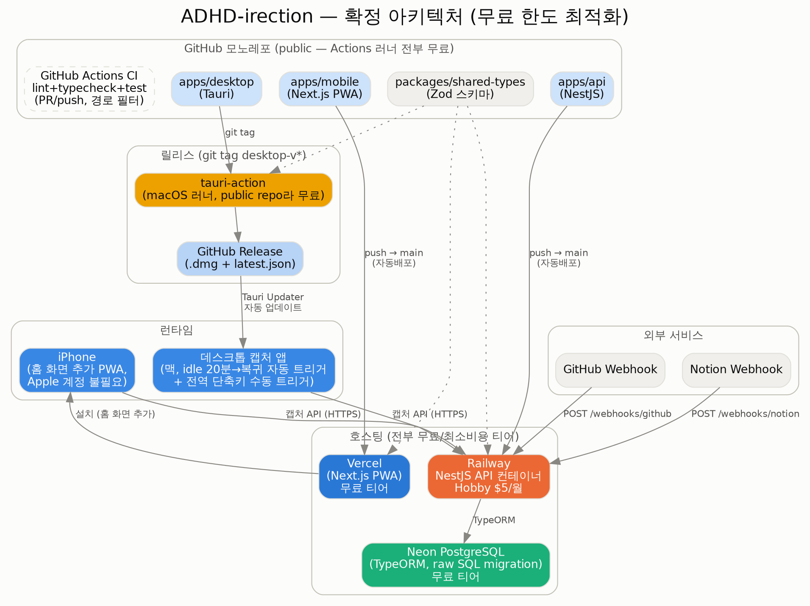

# ADHD-irection 기술 스택 및 아키텍처 (확정)

> 현재 확정된 상태 + 각 선택의 이유. 결정이 바뀐 과정과 실측 근거는 `decision-log.md` 참고.

## 프로젝트 개요

집중력·단기 작업 기억이 좋지 않은 사용자(개발자 본인)를 위해, 코딩·학습·작업 전환 등의 패턴을 분석하고 인터럽트 발생 시점을 저마찰로 캡처해주는 개인용 시스템.

## 확정 아키텍처

---

## Frontend (FE)

| 구성 요소 | 선택 | 이유 |
|---|---|---|
| **데스크톱 캡처 앱** | Tauri (Rust 셸 + React/TS UI) | 실제 작업 전환이 일어나는 곳은 모바일이 아니라 맥이라, 캡처 기능은 반드시 데스크톱에 있어야 함(`decision-log.md` 1절 참고). Electron 대비 상시 상주 유틸리티로서 메모리 부담이 훨씬 적음 |
| **모바일** | Next.js PWA (Expo/RN 대체) | 필요한 기능(음성 녹음, PDF 업로드, 대시보드 리뷰, iOS 16.4+ Web Push)이 PWA로 전부 커버됨. Expo 대신 이걸 쓰면 Apple Developer Program(연 $99)이 아예 불필요해지고, 기존 코어 스택(Next.js)을 그대로 재사용해 러닝커브가 더 낮음 |

### 캡처 트리거 로직 (실측 데이터 기반)

로컬 저장소 6개의 실제 커밋 이력 1,375건을 분석해 결정 — 근거는 `decision-log.md` 6~7절 참고.

- **자동 트리거**: 시스템 유휴시간 20분 이상 지속 후 활동 재개(idle→resume) 시점에 캡처 모달 팝업. 직전 캡처로부터 20분 이내 재발생 안 함. 시간대 제한 없음(심야 작업 22.7%)
- **수동 트리거**: 전역 단축키로 항상 보조 가능
- **보류**: 활성 창 전환 자동 감지(Accessibility API 기반) — 실측상 소수 케이스(6%)라 2단계로 연기

### 캡처 입력 방식 (타이핑 마찰 제거)

- 1순위: 음성 메모 — 원탭 녹음 → 비동기 STT(Whisper/Claude API)
- 2순위: 원탭 프리셋 태그 — "막힘" / "거의 다 함" / "전환함" / "휴식"
- 보조: 캡처 시점 활성 앱 정보 자동 기록

---

## Backend (BE)

| 구성 요소 | 선택 | 이유 |
|---|---|---|
| **백엔드** | NestJS | Next.js API Route에서 분리해 별도 서버로 구축 — 구조화된 모듈/DTO 검증 등 프레임워크 지원이 필요한 규모로 판단 |
| **DB** | PostgreSQL + TypeORM, 마이그레이션은 raw SQL 직접 작성 | Supabase 같은 매니지드 BaaS 대신 채택. SQL 기반 스택을 최종 목표로 삼고 있어 복잡한 관계형 스키마를 직접 설계·운영하는 경험 자체가 목적 |

### 작업 흔적 표시와 보상 (핵심 기획)

커밋·캡처·작업용 앱 사용 흔적(데스크톱이 1분마다 기록)을 "작업 블록"(하루 30분 칸 48개) 단위로 합쳐 웹 첫 화면에 보여준다. 보상은 작게·즉시·벌점 없이 — 연속 기록 대신 돌아온 횟수와 "최근 7일 중 N일"을 센다. 근거와 단계는 `decision-log.md` 23절.

### 패턴 분석 방식

OS 레벨 사용량 API(Android `UsageStatsManager`, iOS Screen Time 계열)는 권한 제약과 플랫폼 비대칭이 커서, 앱 자체 행동 로그(캡처 이벤트, 세션 로그)를 1차 신호로 사용한다.

### 외부 데이터 소스 연동

- **GitHub API**: 커밋 작성 시각을 코딩 리듬 신호로 사용. API 배포 전까지는 웹훅 대신 5분 주기 폴링(GraphQL), 접근 가능한 모든 레포·브랜치의 내 커밋을 가져옴 (`decision-log.md` 23절)
- **Notion API**: 정리용 페이지 하나의 편집을 작업으로 간주해 동기화 (예정, 폴링)
- **Webhook 전환**: API가 공개 주소로 배포된 뒤

### 학습 노트(태블릿) 연동

- Samsung Notes는 서드파티 API 미제공 → 자동 연동 대신 PDF export 후 앱에 직접 업로드
- 텍스트 위주는 `pdf-parse`로 추출, 손글씨 위주는 비전 모델 fallback

### 패턴 연결 분석 아이디어

- 학습노트 업로드 시각 ↔ 이후 GitHub 커밋 시각 간격 → 개념 이해에 걸린 시간 추정
- 업로드 빈도/시간대 패턴 → 컨텍스트 스위칭 및 집중 패턴 추정

---

## DevOps / Infra

### 모노레포 & 툴링

| 구성 요소 | 선택 | 이유 |
|---|---|---|
| **모노레포** | pnpm workspaces (`apps/web`, `apps/desktop`, `apps/api`, `packages/shared-types`) | 세 앱이 같은 API 계약(Zod 스키마)을 공유해야 하고, 스키마 변경이 세 곳을 동시에 건드리는 구조라 원자적 커밋 관리가 중요. 1인 개발이라 멀티레포 오버헤드를 감당할 이유가 없음 |
| **Turborepo** | 보류 | 태스크 오케스트레이션/캐싱은 빌드가 실제로 아파질 때 필요한 최적화 레이어. 지금 구조(`apps/*`, `packages/*`)가 이미 Turborepo 표준 구조라 나중에 추가해도 마이그레이션 비용이 없음 — 그래서 지금 넣지 않음 |

### 배포 (전부 무료/최소비용 티어)

| 서비스 | 역할 | 비용 | 이유 |
|---|---|---|---|
| **Vercel** | Next.js PWA 호스팅 | 무료 티어 | Vercel은 Next.js에 최적화된 플랫폼. NestJS 같은 상시 실행 서버와 달리 PWA는 정적+서버리스라 궁합이 좋음 |
| **Railway** | NestJS API 컨테이너 | Hobby $5/월 (고정) | Render 무료 티어는 15분 무활동 시 슬립되어 재기동 지연이 있음. 그 지연을 없애는 대가로 월 $5는 감수 가능한 수준으로 판단 |
| **Neon** | PostgreSQL | 무료 티어 | 개인 캡처 데이터 규모에서 충분 |
| **GitHub Actions** | CI(lint/test) + 데스크톱 릴리스 빌드(tauri-action) | **완전 무료** | 레포를 **public으로 유지**하는 한 러너 종류(Linux/macOS) 상관없이 무제한 무료. macOS 러너의 10배 과금 배수는 private 레포에만 적용되는 규정이라 이 프로젝트엔 해당 없음 |

**예상 총 비용: 월 $5 (Railway 고정비)**, 나머지는 전부 $0.

### 비용 상한선 원칙

- 지금 단계: 월 $0~5 유지가 목표
- AWS(ECS Fargate + RDS)로 확장 시: NAT Gateway를 켜지 않는 구조로 가면 월 1~1.5만원 선에서 가능 — **NAT Gateway를 실무처럼 그대로 쓰는 순간이 "미니 프로젝트 범위를 넘는" 실질적 경계선**
- AWS 확장은 지금 당장 필요한 게 아니라 학습 목적의 다음 단계로 남겨둠 (자세한 로드맵은 `decision-log.md` 참고)

---

## 보류/미확정

- Samsung Notes 자유 필기 자산의 구조화된 데이터 전환(Excalidraw 등) — 우선순위 낮음
- 활성 창 전환 자동 감지 — 2단계 이후 재검토
- 캡처 시점 화면 스크린샷 저장 — 활성 앱 이름·창 제목(텍스트) 기록을 먼저 써 보고 재검토 (`decision-log.md` 21절)
- Turborepo 도입 — 재도입 트리거 발생 시 (`decision-log.md` 참고)
- AWS(ECS Fargate + RDS) 확장 — 학습 목적, 시점 미정
